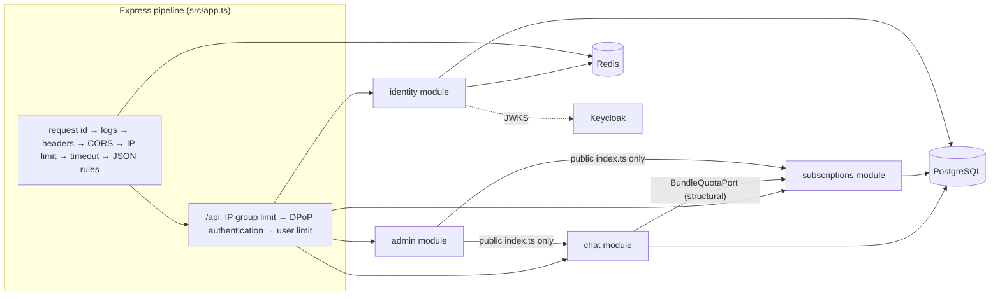
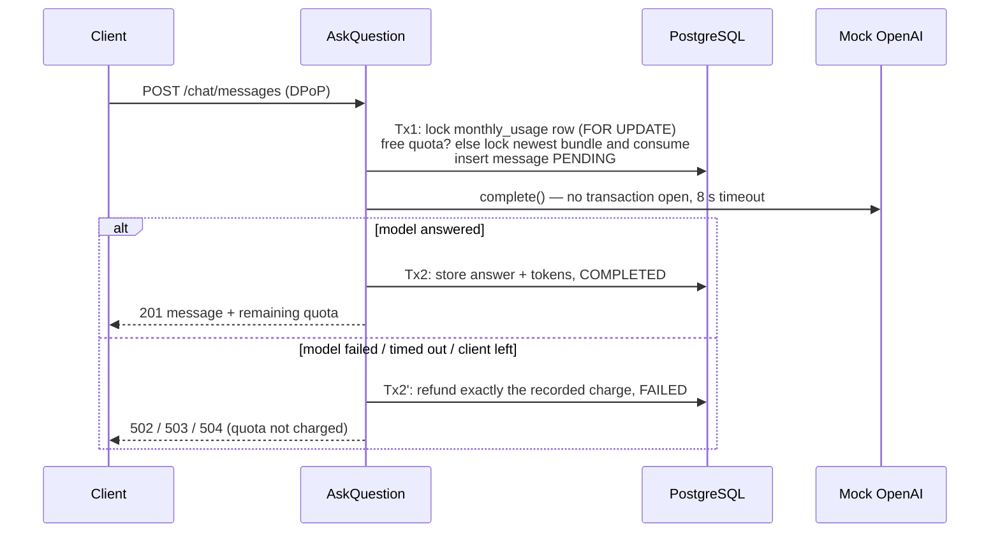

# Secure AI Chat & Subscription Bundles API

[](https://github.com/fasisandhu/muhammad-faseeh/actions/workflows/ci.yml)

TypeScript (strict) · Express 5 · Domain-Driven Design · PostgreSQL 17 · Redis 7 · Keycloak 26 (OIDC) · **DPoP-bound tokens** · Vitest + Testcontainers

Backend for the GGI "Backend Test Posture" assessment ([PDF](docs/GGI%20-%20Backend%20Test%20Posture.pdf)): an AI chat endpoint with a mocked OpenAI model, monthly free quota and paid subscription bundles, simulated billing, and a security-first request pipeline. **Every endpoint is protected**; a stolen access token alone cannot call the API.

- [Quick start](#quick-start) · [Requirements → code](#requirements--code) · [Architecture](#architecture) · [Domain rules](#domain-rules-and-interpretations) · [Security model](#security-model) · [API](#api-reference) · [Testing](#testing) · [Operations](#running-and-operating)

## Quick start

Prerequisites: Docker Desktop, Node.js 24, pnpm 9 (`corepack enable`).

```bash
cp .env.example .env            # PowerShell: Copy-Item .env.example .env — then replace every change-me value
docker compose up -d --build    # postgres, redis, keycloak (realm auto-imported), migrations, api
pnpm install
pnpm e2e:smoke                  # logs in through the real Keycloak and exercises the whole API (13 checks)
pnpm cli login                  # browser login: alice@example.com / Alice-Demo-Pass-2026!
pnpm cli chat "What is DPoP?"
```

> **Replace the placeholders in `.env` before you start the stack.** [.env.example](.env.example) contains placeholders, not secrets. Copied unchanged it gives you a publicly known health/metrics probe token (`HEALTH_CHECK_TOKEN`) and a publicly known Keycloak admin password (`KEYCLOAK_ADMIN_PASSWORD`), plus guessable database and Redis passwords. Generate your own values for every `change-me…` entry; if you change the database or Redis passwords, update the matching passwords inside `DATABASE_URL`, `DATABASE_MIGRATION_URL` and `REDIS_URL` as well. `.env` is git-ignored.

| Demo account (local only) | Password                | Roles       |
| ------------------------- | ----------------------- | ----------- |
| `alice@example.com`       | `Alice-Demo-Pass-2026!` | user        |
| `admin@example.com`       | `Admin-Demo-Pass-2026!` | user, admin |

These two accounts and their passwords are committed in [keycloak/realm-ggi.json](keycloak/realm-ggi.json) on purpose: they are **deliberate, local-only demo credentials, not secrets**, so that a reviewer can log in without any setup. They only exist inside the throwaway local Keycloak; never import this realm file into a shared or production identity provider.

New accounts can self-register on the Keycloak login page; "Sign in with GitHub" works once a GitHub OAuth App is configured ([how](#github-login)).

> Why a CLI? Requests must carry a DPoP proof signed with the client's private key, which curl and Postman cannot produce. `pnpm cli request GET /api/v1/auth/me` works for any endpoint.

## Requirements → code

<!-- One row per bullet of the PDF. Paths are links. Keep in sync with the code. -->

| Requirement (PDF)                                                                                    | Implementation                                                                                                                                                                                                                    |
| ---------------------------------------------------------------------------------------------------- | --------------------------------------------------------------------------------------------------------------------------------------------------------------------------------------------------------------------------------- |
| Secured endpoint accepts a question; mocked OpenAI response with simulated latency                   | `POST /api/v1/chat/messages` → [ask-question.ts](src/modules/chat/application/ask-question.ts), [mock-openai-client.ts](src/modules/chat/infrastructure/mock-openai-client.ts)                                                    |
| Store question, answer, token usage, request metadata                                                | [`chat_messages`](src/modules/chat/repositories/schema.ts) (question, answer, prompt/completion/total tokens, request id, user, timestamps, latency)                                                                              |
| Monthly usage per user; 3 free messages; reset on the 1st                                            | [`monthly_usage`](src/modules/chat/repositories/schema.ts) keyed by `(user, YYYY-MM UTC)` — a new month is a new row, [UsagePeriod](src/modules/chat/domain/value-objects/usage-period.ts)                                        |
| Bundle required after free quota; Basic 10 / Pro 100 / Enterprise unlimited; multiple active bundles | [QuotaAllocator](src/modules/chat/domain/services/quota-allocator.ts), [PlanCatalog](src/modules/subscriptions/domain/services/plan-catalog.ts)                                                                                   |
| Deduct from the bundle with the latest remaining quota                                               | [BundleSelectionPolicy](src/modules/subscriptions/domain/policies/bundle-selection-policy.ts)                                                                                                                                     |
| Structured, typed error when no quota                                                                | `402 QUOTA_EXHAUSTED` problem document ([errors.ts](src/modules/chat/domain/errors.ts))                                                                                                                                           |
| Atomic, concurrency-safe deduction in DB transactions                                                | row locks in [usage-repository.ts](src/modules/chat/repositories/usage-repository.ts) + [context.ts](src/shared/infrastructure/db/context.ts); proven by [concurrency.int.test.ts](test/integration/concurrency.int.test.ts)      |
| Create bundles, monthly/yearly, auto-renew; maxMessages, price, start/end/renewal dates, status      | [subscription-routes.ts](src/modules/subscriptions/controllers/subscription-routes.ts), [Subscription](src/modules/subscriptions/domain/entities/subscription.ts)                                                                 |
| Auto-renewal, random payment failures → inactive; cancellation keeps history                         | [run-billing-cycle.ts](src/modules/subscriptions/application/run-billing-cycle.ts), [simulated-payment-gateway.ts](src/modules/subscriptions/infrastructure/simulated-payment-gateway.ts)                                         |
| External OAuth2/OIDC provider; email/password + an OAuth provider; no custom auth                    | Keycloak realm as code: [realm-ggi.json](keycloak/realm-ggi.json) (GitHub identity provider)                                                                                                                                      |
| All endpoints protected; tokens verified server-side (iss, aud, exp)                                 | [access-token-verifier.ts](src/modules/identity/infrastructure/access-token-verifier.ts); `/api` authenticates before routing ([app.ts](src/app.ts)); [route-inventory.int.test.ts](test/integration/route-inventory.int.test.ts) |
| Token alone not sufficient + extra mechanism                                                         | **DPoP** (RFC 9449) [dpop-proof-verifier.ts](src/modules/identity/infrastructure/dpop-proof-verifier.ts) with replay cache and timestamp window; session revocation on logout                                                     |
| RBAC user/admin at controller **and** domain-policy level                                            | [routing.ts](src/shared/http/routing.ts) `access.roles` + policies in `src/modules/*/domain/policies/`                                                                                                                            |
| Secure headers, restricted CORS, size limits, strict content type, global timeout                    | [src/shared/http/](src/shared/http) (`security-headers`, `cors`, `body-parser`, `content-negotiation`, `timeout`)                                                                                                                 |
| Per-IP and per-user rate limits, different per group                                                 | [rate-limit.ts](src/shared/http/rate-limit.ts); [rate-limit.int.test.ts](test/integration/rate-limit.int.test.ts)                                                                                                                 |
| Schema validation, unknown fields rejected, XSS/injection sanitisation, no mass assignment           | Zod strict schemas in each `controllers/`, [sanitize.ts](src/shared/http/sanitize.ts)                                                                                                                                             |
| Clean Architecture layers; framework-free business logic; independent modules                        | `src/modules/{chat,subscriptions,identity,admin}`; rules **enforced by ESLint** ([eslint.config.js](eslint.config.js), [layer-rules.test.ts](test/unit/architecture/layer-rules.test.ts))                                         |
| TS strict, migrations, env config, ESLint + Prettier enforced                                        | [tsconfig.json](tsconfig.json), [migrations/](migrations), [env.ts](src/shared/infrastructure/config/env.ts), husky pre-commit + [CI](.github/workflows/ci.yml)                                                                   |
| Centralised errors, structured logs (request id, user id, response time), health, metrics            | [error-handler.ts](src/shared/http/error-handler.ts), [http-logger.ts](src/shared/http/http-logger.ts), `/health/*`, `GET /api/v1/admin/metrics`                                                                                  |
| Unit + integration tests; auth provider mocked, not bypassed                                         | [test/](test) — [mock-idp.ts](test/support/mock-idp.ts) serves a real JWKS; the production verifier runs unchanged                                                                                                                |

## Architecture



Every module has the same layers, and **ESLint enforces the arrows** (CI fails otherwise):

| Layer                                                          | Contains                                                              | May depend on                                                     |
| -------------------------------------------------------------- | --------------------------------------------------------------------- | ----------------------------------------------------------------- |
| `domain/` (entities, value-objects, services, policies, ports) | business rules in plain TypeScript                                    | `src/shared/domain` only — no Express, Drizzle, Redis, Zod, jose… |
| `application/`                                                 | use cases (one class per operation)                                   | domain ports, shared ports                                        |
| `repositories/`                                                | Drizzle schema + port implementations                                 | own domain, DB helpers                                            |
| `infrastructure/`                                              | adapters (mock OpenAI, payment gateway, jose verifiers, Redis stores) | own domain                                                        |
| `controllers/`                                                 | route definitions, Zod schemas, DTO mappers                           | own application/domain, `shared/http`                             |

Modules reference each other only through `index.ts`. Chat needs bundles but never imports the subscriptions module: it declares a `BundleQuotaPort`; the composition root ([bootstrap.ts](src/bootstrap.ts)) passes subscriptions' `BundleQuotaService`, which matches it structurally.

### How a chat message is charged (reserve → model → finalize)



Locks are held for milliseconds, never during the model call. All flows take locks in the same order (`monthly_usage → subscriptions → chat_messages`), so they cannot deadlock. A background sweeper refunds reservations orphaned by a crash. Database `CHECK` constraints (a bundle's `used_messages` never exceeds `max_messages`, no negative counters) are the last line of defence.

### Key decisions

| Decision                                                                 | Why                                                                                   |
| ------------------------------------------------------------------------ | ------------------------------------------------------------------------------------- |
| Express 5 with an explicit middleware order                              | every security control is visible, in order, in one file                              |
| Routes declared as data (`defineRoute`)                                  | a route cannot exist without an access rule; the inventory test proves none is open   |
| Keycloak in Docker, realm committed as JSON                              | standard OIDC, reproducible for reviewers, native DPoP                                |
| DPoP for "token alone is not enough"                                     | the only option that makes a leaked token useless; a standard, not custom crypto      |
| Redis for limits, replay cache, revocations                              | shared across API instances, TTL-native                                               |
| Ambient transactions (AsyncLocalStorage)                                 | use cases stay framework-free; repositories in different modules join one transaction |
| Least-privilege DB role (`SELECT, INSERT, UPDATE` — no `DELETE`, no DDL) | history cannot be deleted even by a bug; migrations run as a separate owner role      |
| RFC 9457 problem documents with stable `code`                            | typed, machine-readable errors                                                        |
| Keyset pagination (`created_at, id`)                                     | stable pages under concurrent inserts                                                 |

## Domain rules and interpretations

The PDF leaves some rules open; these are the choices made, all in one place in the code:

1. **"Bundle with the latest remaining quota"** = the most recently started active bundle that still has messages. (Soonest-expiring-first is often friendlier to customers; switching is a one-line change in `BundleSelectionPolicy`.)
2. **Allowances are per billing cycle and are granted when the cycle starts**: Basic 10, Pro 100, Enterprise unlimited per month. A yearly cycle is one pool of 12× the monthly allowance (not 10 per month) at 10× the monthly price; the pool resets when the subscription renews.

   | Plan       | Monthly               | Yearly                   |
   | ---------- | --------------------- | ------------------------ |
   | Basic      | $9.99 · 10 messages   | $99.90 · 120 messages    |
   | Pro        | $29.99 · 100 messages | $299.90 · 1 200 messages |
   | Enterprise | $99.99 · unlimited    | $999.90 · unlimited      |

3. **Cancellation ends the current cycle immediately** and disables renewal; nothing is deleted. Turning auto-renew off is how a subscription lapses at the end of its period.
4. **Months are UTC calendar months.** The free quota is 3 messages per month and is used before any bundle.
5. **The first purchase also goes through the simulated payment.** A decline returns `402 PAYMENT_FAILED` and keeps the subscription as `INACTIVE` for the audit trail.
6. **A failed, timed-out or abandoned model call never consumes quota.**
7. **Health endpoints require a probe token** (`X-Health-Token`) because the PDF forbids open endpoints.

## Security model

### "A token alone must not be enough": DPoP in plain terms

A normal access token is like cash: whoever holds it can spend it. With **DPoP** (Demonstrating Proof-of-Possession, RFC 9449) the token is bound to a key pair that only the real client holds — like a boarding pass with your passport number printed on it.

1. At login the client creates a key pair; the private key never leaves it.
2. Keycloak puts the public key's thumbprint into the token (`cnf.jkt`).
3. Every API call carries the token **and** a one-time proof signed with the private key: _method, URL, time, hash of this token, unique id_.
4. The API accepts the call only if the proof is valid, fresh (issued at most 60 s ago, and at most 5 s in the future to allow for clock drift), for this exact request, signed by the key the token is bound to, and never seen before.

A thief with the token cannot sign proofs; a captured proof works for one request, once, for one minute.

### What the API checks on every `/api` request

1. Per-IP limits (global, then per endpoint group) — before any crypto.
2. `Authorization: DPoP <token>` (Bearer is refused) and exactly one `DPoP` header.
3. Token signature against Keycloak's JWKS (cached), algorithm allowlist (no `none`/HMAC), `iss`, `aud` contains `ggi-api`, `exp`/`nbf`, `sub`, and `cnf.jkt` present.
4. Proof: `typ`, algorithm, public-only embedded key, signature, `htm`/`htu` match the request (built from `PUBLIC_BASE_URL`, never the `Host` header), `iat` window, `ath` = hash of the token, key thumbprint = `cnf.jkt`, `jti` unseen (Redis `SET NX`; fails closed if Redis is down).
5. Session not revoked by logout (`sid`, or `jti` if no `sid`).
6. At least one application role; the user is provisioned just-in-time.
7. Per-user limit for the endpoint group, then the route's role guard, strict validation, the use case and its domain policy.

Repeated authentication failures from one IP exhaust an auth-failure budget (`429`); Keycloak itself temporarily locks an account after 5 failed logins (waiting 1 minute, growing to at most 15 minutes).

### Threats and controls

| Threat                                                           | Control                                                                                                            |
| ---------------------------------------------------------------- | ------------------------------------------------------------------------------------------------------------------ |
| Stolen or leaked access token                                    | DPoP-bound tokens + per-request proofs                                                                             |
| Replayed request                                                 | `jti` replay cache + `iat` window                                                                                  |
| Forged token, algorithm confusion, ID token used as access token | JWKS signature, alg allowlist, `iss`/`aud`/`exp` checks                                                            |
| Session hijack after logout                                      | server-side session revocation checked on every request                                                            |
| Credential stuffing / brute force                                | Keycloak brute-force lockout, password policy; API auth-failure budget per IP                                      |
| Privilege escalation                                             | roles only from the IdP; controller guard **and** domain policy                                                    |
| IDOR (reading others' data)                                      | ownership policies; foreign ids return `404`                                                                       |
| Mass assignment                                                  | strict schemas reject unknown fields; price, limits, dates, status are server-derived                              |
| Stored XSS                                                       | markup stripped and text escaped on input; JSON-only responses; `CSP default-src 'none'`                           |
| SQL injection                                                    | parameterised queries only; ESLint bans `sql.raw`; ids validated as UUIDs                                          |
| CSRF                                                             | no cookies — tokens travel in headers; exact-origin CORS allowlist                                                 |
| Clickjacking, MIME sniffing                                      | `frame-ancestors 'none'`, `X-Frame-Options: DENY`, `nosniff`                                                       |
| Resource exhaustion                                              | 16 KB bodies, 2 KB URLs, socket timeouts, 10 s request deadline, rate limits per IP and per user                   |
| Quota races, double charging                                     | row locks in transactions, DB check constraints, unique payment per period, `SKIP LOCKED` billing                  |
| Information leakage                                              | problem documents without stack traces; detailed auth failure reasons only in logs; credentials redacted from logs |
| Secret leakage                                                   | environment-only configuration validated at startup; `.env` git-ignored; least-privilege DB role                   |
| Vulnerable dependencies                                          | lockfile, Dependabot, `pnpm audit` (report-only), CodeQL in CI                                                     |

### Rate limits (defaults; all configurable)

| Group                                    | Per IP        | Per user |
| ---------------------------------------- | ------------- | -------- |
| everything (before auth)                 | 300/min       | —        |
| `/auth/*`                                | 20/min        | 10/min   |
| `/chat/*`                                | 60/min        | 20/min   |
| `/subscriptions*`, `/subscription-plans` | 60/min        | 30/min   |
| `/admin/*`                               | 120/min       | 60/min   |
| failed authentications                   | 30 per 15 min | —        |

Responses carry `RateLimit-Limit`, `RateLimit-Remaining`, `RateLimit-Reset`; `429` adds `Retry-After`. Behind a proxy set `TRUST_PROXY` to the hop count so per-IP limits see the real client.

### Production hardening (beyond this assessment)

TLS everywhere (HSTS is already sent); Keycloak in production mode (`start` instead of the demo's `start-dev`) with its own external PostgreSQL database, TLS, a fixed hostname and email verification (SMTP); secrets from a vault; DPoP server nonces; a two-step outbox flow for a real payment provider; OpenTelemetry tracing; a WAF in front.

## API reference

Base URL `http://localhost:3000/api/v1`. Success: `{ "data": … }`; lists: `{ "data": [...], "page": { "limit", "nextCursor" } }` (`?limit=1..100&cursor=…`, default limit 20).

| Method & path                                                | Roles                                              | Purpose                                                                |
| ------------------------------------------------------------ | -------------------------------------------------- | ---------------------------------------------------------------------- |
| `GET /auth/me`                                               | user, admin                                        | principal and token binding                                            |
| `POST /auth/logout`                                          | user, admin                                        | revoke the session (204)                                               |
| `POST /chat/messages` `{ question }`                         | user, admin                                        | ask; 201 with answer, token usage, remaining quota                     |
| `GET /chat/messages` · `GET /chat/messages/:id`              | user, admin (list: own; by id: owner or any admin) | history                                                                |
| `GET /chat/usage`                                            | user, admin                                        | free quota, paid usage, bundles                                        |
| `GET /subscription-plans`                                    | user, admin                                        | catalog                                                                |
| `POST /subscriptions` `{ tier, billingCycle, autoRenew }`    | user, admin                                        | buy (201, or 402 if declined)                                          |
| `GET /subscriptions` (`?status=`) · `GET /subscriptions/:id` | user, admin (list: own; by id: owner or any admin) | read                                                                   |
| `PATCH /subscriptions/:id` `{ autoRenew }`                   | user, admin (owner or any admin)                   | toggle renewal                                                         |
| `POST /subscriptions/:id/cancellation`                       | user, admin (owner or any admin)                   | cancel now                                                             |
| `GET /admin/metrics`                                         | admin                                              | usage, subscriptions, payments                                         |
| `GET /admin/chat/messages` · `GET /admin/subscriptions`      | admin                                              | system-wide listings (`?userId=` on both, `?status=` on subscriptions) |
| `POST /admin/billing-runs`                                   | admin                                              | process renewals and expiries now                                      |
| `GET /health/live` · `GET /health/ready`                     | `X-Health-Token`                                   | probes                                                                 |

Errors are `application/problem+json`:

```json
{
  "type": "urn:ggi:problem:quota-exhausted",
  "title": "Quota exhausted",
  "status": 402,
  "detail": "All 3 free messages for 2026-10 are used and no active bundle has messages left.",
  "instance": "/api/v1/chat/messages",
  "code": "QUOTA_EXHAUSTED",
  "requestId": "6f0c…",
  "details": {
    "period": "2026-10",
    "free": { "limit": 3, "used": 3, "resetsAt": "2026-11-01T00:00:00.000Z" },
    "bundles": { "active": 0, "withRemaining": 0 }
  }
}
```

Codes: `VALIDATION_FAILED`, `MALFORMED_JSON` (400) · `UNAUTHENTICATED` (401) · `QUOTA_EXHAUSTED`, `PAYMENT_FAILED` (402) · `FORBIDDEN`, `CORS_ORIGIN_DENIED` (403) · `NOT_FOUND`, `ROUTE_NOT_FOUND` (404) · `NOT_ACCEPTABLE` (406) · `SUBSCRIPTION_NOT_ACTIVE`, `INVALID_STATE` (409) · `PAYLOAD_TOO_LARGE` (413) · `URI_TOO_LONG` (414) · `UNSUPPORTED_MEDIA_TYPE` (415) · `RATE_LIMITED` (429) · `INTERNAL_ERROR` (500) · `LLM_UNAVAILABLE` (502) · `SERVICE_UNAVAILABLE`, `REQUEST_TIMEOUT` (503) · `LLM_TIMEOUT` (504).

## Testing

```bash
pnpm test:unit          # domain, policies, verifiers, sanitiser, config (no I/O)
pnpm test:coverage      # same, with a coverage gate on domain code (90 % lines/functions/statements, 85 % branches)
pnpm test:integration   # real Postgres + Redis via Testcontainers (Docker required)
pnpm e2e:smoke          # against the running docker compose stack and real Keycloak
pnpm check              # everything CI runs
```

- **The auth provider is mocked, not bypassed:** [mock-idp.ts](test/support/mock-idp.ts) signs real JWTs and serves a JWKS over HTTP; the app verifies them with the production code. [dpop-client.ts](test/support/dpop-client.ts) signs real proofs.
- Highlights: every way authentication can fail (stolen token, replay, wrong audience, expired, forged, logged-out session, garbage headers); every route rejects anonymous calls; 25 parallel requests against 3 free + 10 bundle messages succeed exactly 13 times; refunds on model failure, timeout, client disconnect and month rollover; billing renewals, declines, expiry, catch-up and concurrent runs without double charging; rate limits per group, per user and per IP; every security header and body rule.

## Running and operating

| Service    | URL                                                            | Notes                                                               |
| ---------- | -------------------------------------------------------------- | ------------------------------------------------------------------- |
| API        | http://localhost:3000                                          | non-root, read-only container                                       |
| Keycloak   | http://localhost:8080 (admin console: credentials from `.env`) | realm `ggi` imported at start; `start-dev` (embedded H2), demo only |
| PostgreSQL | localhost:5432 (`POSTGRES_HOST_PORT`)                          | owner `ggi_owner` (migrations), app role `ggi_app`                  |
| Redis      | localhost:6379 (`REDIS_HOST_PORT`)                             | password from `.env`                                                |

All ports are bound to `127.0.0.1`. Configuration is environment-only and validated at startup ([env.ts](src/shared/infrastructure/config/env.ts) lists every variable and default; [.env.example](.env.example) has placeholders).

**Port clashes.** If the machine already runs PostgreSQL or Redis locally, set `POSTGRES_HOST_PORT` and/or `REDIS_HOST_PORT` in `.env` (compose publishes `${POSTGRES_HOST_PORT:-5432}` and `${REDIS_HOST_PORT:-6379}`). Containers still talk to each other on the standard ports; only the host side changes. Anything that runs on the host (`pnpm dev` and `pnpm db:migrate`) reaches the databases through the published port, so `DATABASE_URL`, `DATABASE_MIGRATION_URL` and `REDIS_URL` in `.env` must use the same port, for example `POSTGRES_HOST_PORT=5433` together with `…@localhost:5433/ggi`.

**Keycloak is a demo setup.** Compose runs Keycloak with `start-dev` and its embedded H2 database, which is convenient locally and not a production configuration. Production would use `start` with an external PostgreSQL database, TLS and a fixed hostname (see [Production hardening](#production-hardening-beyond-this-assessment)).

### GitHub login

1. GitHub → Settings → Developer settings → OAuth Apps → New OAuth App.
2. Homepage URL `http://localhost:8080`; callback URL `http://localhost:8080/realms/ggi/broker/github/endpoint`.
3. Put the client id and secret into `.env` (`GITHUB_CLIENT_ID`, `GITHUB_CLIENT_SECRET`), then `docker compose up -d --force-recreate keycloak` (the realm is imported when the Keycloak container is created, so it must be recreated; accounts registered in the old container are lost).

### CLI

`pnpm cli login | logout | me | usage | plans | chat "<question>" | messages | subs list | subs create PRO YEARLY [--no-auto-renew] | subs auto-renew <id> on|off | subs cancel <id> | admin metrics | admin billing-run | admin messages | admin subscriptions | request <METHOD> <path> [json]`.

The CLI is a local demo client. After login it keeps its session in `.ggi-cli/session.json` (git-ignored): the access and refresh tokens and the DPoP private key (stored as a JWK and loaded back as a non-extractable key). On macOS and Linux the file is created with mode 0600. On Windows file modes do not apply, so the file simply inherits the permissions of the folder it lives in; treat it like a password file and run `pnpm cli logout` when you are done, which revokes the session and deletes the file.

### Observability

One JSON log line per request:

```json
{
  "level": 30,
  "time": "2026-10-02T12:00:00.000Z",
  "service": "ggi-api",
  "requestId": "6f0c…",
  "userId": "a1b2…",
  "req": {
    "id": "6f0c…",
    "method": "POST",
    "url": "/api/v1/chat/messages",
    "remoteAddress": "::ffff:172.18.0.1"
  },
  "res": { "statusCode": 201 },
  "responseTimeMs": 742,
  "route": "/api/v1/chat/messages",
  "msg": "request completed"
}
```

`Authorization`, `DPoP`, `X-Health-Token` and cookie headers never appear in logs, and query strings are dropped from the logged URL. `/health/live` and `/health/ready` (database and Redis) serve probes; `GET /api/v1/admin/metrics` reports messages (free/paid/failed), tokens, active users, subscriptions by tier/cycle/status and this month's payments. Billing renewals and the reservation sweeper run in-process every minute (`JOBS_INTERVAL_MS`); admins can trigger billing with `POST /api/v1/admin/billing-runs`.

### Run the API outside Docker

`docker compose up -d postgres redis keycloak && pnpm db:migrate && pnpm dev` (uses the "Only for `pnpm dev` outside docker" block of `.env`; keep its host ports in line with `POSTGRES_HOST_PORT` / `REDIS_HOST_PORT`).

## Project structure

```
src/
  app.ts · bootstrap.ts · main.ts · migrate.ts
  modules/
    chat/           domain · application · repositories · infrastructure · controllers
    subscriptions/  domain · application · repositories · infrastructure · controllers
    identity/       domain · application · repositories · infrastructure · controllers
    admin/          application · controllers
  shared/           domain · application · infrastructure · http
migrations/   keycloak/   docker/   cli/   scripts/   test/{unit,integration,support}
```

## How this was built

I used an AI coding assistant (Claude Code) as a pair programmer for this assessment. I made the design decisions — Express 5, Keycloak with DPoP-bound tokens, the reserve → model → finalize quota flow, and the readings of the ambiguous requirements listed above — and worked from a written design and a test-first implementation plan. The assistant wrote much of the code against that plan; every change went through the same gates as the rest of the repository (strict TypeScript, ESLint layer rules, unit and integration tests, the end-to-end smoke test and CI), and I reviewed it. I'm happy to walk through any part of the code.
